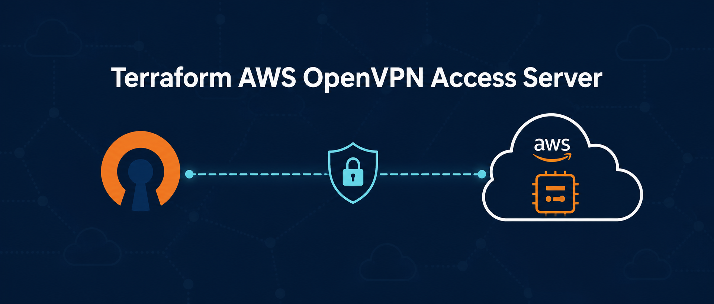

# Terraform AWS OpenVPN Access Server



Reusable clean-room Terraform module for deploying OpenVPN Access Server on AWS. The module creates the AWS infrastructure and installs Access Server without storing administrator passwords, activation keys, customer VPN profiles, or other secrets in Terraform state.

[מדריך מלא בעברית](README.he.md)

## Features

- Ubuntu 24.04 from Canonical's public SSM AMI parameter.
- OpenVPN Access Server installed from the official package repository.
- Independent Elastic IP and explicit EIP association.
- EC2 source/destination check disabled for VPN forwarding.
- IMDSv2 required and encrypted gp3 root volume.
- SSM Session Manager enabled by default; SSH is optional and disabled by default.
- Restricted administrator CIDRs for TCP 943.
- TCP 443 and UDP 1194 VPN ingress.
- Optional Route 53 A record.
- Terraform and Terragrunt examples.
- GitHub Actions formatting and validation.

## Architecture

```text
Internet
   |
Elastic IP / optional vpn.example.com
   |
Security Group
   |
EC2 Ubuntu 24.04 + OpenVPN Access Server
   |
Customer VPC private resources
```

This is a single-instance design. It does not provide high availability or automatic Access Server configuration backups.

## Dev and staging environment separation

The ready-to-customize template in [`environments/dev-staging`](environments/dev-staging) deploys one OpenVPN Access Server in the development VPC and connects development to staging with VPC peering. VPN clients are given routes to both non-production VPCs. Production is deliberately excluded: the template has no production variables, dependencies, routes, or peer connection.

```text
VPN client
    |
OpenVPN Access Server (dev VPC)
    |                         \
dev resources        VPC peering -> staging resources

production: no connection
```

The stack creates:

- OpenVPN Access Server in the development public subnet.
- A dev-to-staging VPC peering connection with DNS resolution enabled.
- Routes from selected development route tables to the staging CIDR.
- Return routes from selected staging route tables to the development CIDR.
- An OpenVPN private-network route that advertises the staging CIDR to VPN clients.
- A separate Terraform state path for this shared non-production connectivity stack.

### Configure a new company

1. Copy the example values and backend files:

   ```bash
   cd environments/dev-staging
   cp terraform.tfvars.example terraform.tfvars
   cp backend.tf.example backend.tf
   ```

2. Replace every `REPLACE_*` value in `terraform.tfvars` and `backend.tf`. Set the new company's development and staging VPC IDs, non-overlapping CIDRs, development public subnet, route table IDs, trusted administrator CIDRs, state bucket, Region, and tags.
3. Confirm that none of the supplied VPCs, route tables, CIDRs, DNS zones, or AWS credentials belong to production.
4. Use a dedicated AWS profile or role for the new customer and verify it before planning:

   ```bash
   export AWS_PROFILE=REPLACE_CUSTOMER_NONPROD_PROFILE
   aws sts get-caller-identity
   terraform init
   terraform fmt -check -recursive
   terraform validate
   terraform plan
   ```

5. Review both directions of every proposed route and apply only after approval:

   ```bash
   terraform apply
   ```

Do not commit `terraform.tfvars`, backend credentials, state files, VPN profiles, passwords, private keys, account IDs, or real customer network values. The repository ignores common sensitive Terraform and VPN files, but the plan must still be reviewed before publication.

## Requirements

- Terraform 1.9 or newer.
- AWS provider 5.x or 6.x.
- An existing VPC.
- An existing public subnet with a route to an Internet Gateway.
- AWS permissions for EC2, EIP, IAM, SSM, Security Groups, and optionally Route 53.
- A customer-owned OpenVPN Access Server subscription when more than the included free connection allowance is required.

## Quick start

```bash
git clone https://github.com/elyotam/aws-openvpn.git
cd aws-openvpn/examples/terraform
cp terraform.tfvars.example terraform.tfvars
vim terraform.tfvars
```

Verify the active AWS identity:

```bash
aws sts get-caller-identity
```

Validate without changing AWS resources:

```bash
terraform fmt -check -recursive
terraform init -backend=false
terraform validate
```

Create and review a plan:

```bash
terraform init
terraform plan
```

Apply only after the account, Region, values, costs, and plan have been approved:

```bash
terraform apply
```

## Example

```hcl
provider "aws" {
  region = "eu-west-1"
}

module "openvpn" {
  source = "git::https://github.com/elyotam/aws-openvpn.git?ref=v1.0.0"

  name      = "acme-openvpn"
  vpc_id    = "vpc-0123456789abcdef0"
  subnet_id = "subnet-0123456789abcdef0"

  hostname        = "vpn.example.com"
  route53_zone_id = "Z0123456789ABCDEFG"

  vpn_client_cidrs = ["0.0.0.0/0"]
  admin_cidrs      = ["203.0.113.10/32"]

  tags = {
    Customer    = "Acme"
    Environment = "production"
  }
}
```

## First login and administration

Use the module output to start an SSM session:

```bash
terraform output -raw ssm_session_command
```

Then run:

```bash
sudo systemctl status openvpnas --no-pager
sudo cat /var/log/openvpn-access-server-bootstrap.log
sudo cat /usr/local/openvpn_as/init.log
```

The web interfaces are returned as Terraform outputs:

```bash
terraform output admin_url
terraform output client_url
```

After the first login:

1. Change the administrator password immediately.
2. Accept the OpenVPN EULA.
3. Activate a license owned by the customer.
4. Configure authentication and MFA.
5. Configure the private networks users may access.
6. Create users and groups.
7. Replace the self-signed certificate with a trusted certificate.
8. Test connectivity and least-privilege access.

## Customer isolation

Use a separate state and deployment configuration for every customer and environment. Never reuse another customer's:

- Terraform state.
- AWS credentials or account details.
- Activation key.
- Administrator password.
- VPN profiles or private keys.
- Internal CIDRs or DNS values.

See [Customer deployment checklist](docs/CUSTOMER-DEPLOYMENT-CHECKLIST.md).

## Security notes

- SSM Session Manager is preferred over SSH.
- `admin_cidrs` should contain only trusted administrator public IPs.
- Do not pass secrets through `additional_user_data`.
- Terraform user data and state are not secret stores.
- Review every plan before apply.
- TCP 443 can also expose the authenticated web portal, so protect administrator accounts with strong authentication and MFA.

## Cost considerations

This module can create charges for EC2, EBS, public IPv4/Elastic IP, data transfer, Route 53, detailed monitoring, and OpenVPN licensing. Check current AWS and OpenVPN pricing before every customer deployment.

## Inputs

| Name | Description | Default |
|---|---|---|
| `name` | Resource name prefix | `openvpn-as` |
| `vpc_id` | Existing VPC ID | required |
| `subnet_id` | Existing public subnet ID | required |
| `instance_type` | EC2 instance type | `t3.small` |
| `ami_id` | Optional AMI override | `null` |
| `hostname` | Optional public DNS hostname | `null` |
| `route53_zone_id` | Optional Route 53 hosted zone | `null` |
| `vpn_client_cidrs` | Allowed TCP 443 and UDP 1194 CIDRs | `0.0.0.0/0` |
| `admin_cidrs` | Trusted TCP 943 CIDRs | empty |
| `enable_ssh` | Enable TCP 22 | `false` |
| `root_volume_size` | Root disk size in GiB | `20` |
| `tags` | Extra AWS tags | empty |

Refer to `variables.tf` for every available setting.

## Outputs

- `instance_id`
- `private_ip`
- `elastic_ip`
- `server_address`
- `admin_url`
- `client_url`
- `security_group_id`
- `iam_role_name`
- `ssm_session_command`

## Validation

```bash
./scripts/validate.sh
```

The validation script runs formatting checks, initializes without a backend, and validates both the module and the Terraform example. It does not run `apply`.

## Destruction warning

`terraform destroy` deletes managed infrastructure and can immediately interrupt VPN access. Run it only with explicit approval, verified backups, and a recovery plan.
